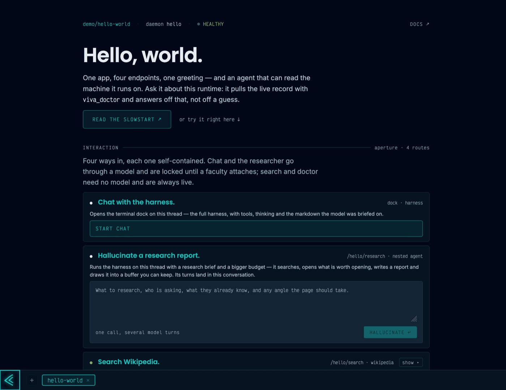
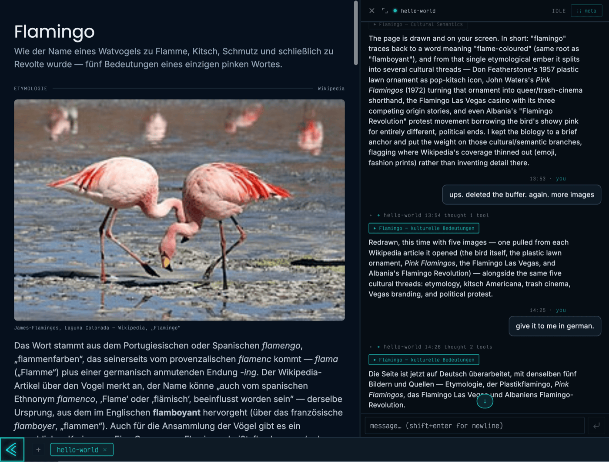

<p align="center"> <a target="_blank" href="https://docs.vivalence.org">Docs</a> · <a href="#hello-mode">Hello</a> · <a href="#quickstart">Quickstart</a> · <a href="#noticeboard">Notices</a> · <a href="#pricing-b2b">Pricing</a> · <a href="#funding-p2p">Funding</a> · <a target="_blank" href="https://discord.gg/QyS9Xt9ht8">Discord</a> </p> <p align="center">  </p> <p align="center"> <a href="LICENSE.md"></a>     <a target="_blank" href="https://ko-fi.com/crackedbeefcake"></a> </p>

~ $home

Vivalence is an agentic, modal operating system. AI-harnessed as a first principle. 

Free for private use, <a href="#pricing-b2b">flat license fee</a> for institutional and commercial use. Fair Source.

## Modality
 
Your setup shouldn't have to be like anyone else's.

Use viva's modes to build your own harnesses, interfaces, dataspaces, agentic experiences - imagination is the limit.

A mode is just JavaScript and Svelte — no magic - but they provide everything an application needs. 

→ **[awesome-vivalence](https://github.com/vivalence/awesome-vivalence)** — the registry. PRs welcome. WIP.

Fork existing systems, hand-roll your own, or prompt one into existence on an architecture designed for it.

Fable put it well the other day:
> The demo isn't the individual app. The demo is that two people run the same domain and end up with different apps.

<!-- - aka beyond mouseless -->
## AI-harnessed as first principle 
means two things: 
**adaptive harnesses** - the agent's tools and identity are shapeable as they execute.
**programmatic context generation** - what the model sees is assembled from live entities and state.
<!-- @beef for example for language learning agents, we pull in the last dozen reviews and due vocabulary into context, enable agent tools based on learner state. -->

# Modes and instances
## Hello, Mode!

The demo mode. Harnessed, conversational, tooled, generative: this mode can chat, navigate Wikipedia, and render ad-hoc research reports.

`commons/instances/hello-world/mode.viva.js` — what it is:
```js
import { App, Vector } from "@vivalence/typology";
import { doctor, research, web } from "./tools/index.js";

export const manifest = {
  type: "demo",
  slug: "hello-world",
  traits: [
    "HARNESSED",      // mode has access to the daemon's harness
    "CONVERSATIONAL", // mode can be chatted with
    "TOOLED",         // mode provides agentic tools

    "EMITTER",        // mode renders ad-hoc buffers
    "APPLICATION",    // buffers from static svelte
    "GENERATIVE",     // buffers hallucinated at runtime

    "EXPOSED",        // mode serves http endpoints
    "STANDALONE",     // mode is an entrypoint on the client
  ],
};

export const app = new App("./app/App.svelte");

export const tools = new Vector()
  .slurp(doctor)
  .slurp(web)
  .slurp(research);

export { harness } from "./harness.js";
export { aperture } from "./aperture.js";
export { emitter, generator } from "./page/index.js";
```

The rest is in <a href="commons/instances/hello-world/README.md">the mode's own README</a>.

## Hello, World!

> Hello, World.
<p align="center"></p>

> Tell me about the cultural and etymological significance of the Flamingo.
<p align="center"></p>

## Hello, Instance!

The instance the mode ships in: the mode in the kernel, two hallucinators and one sqlite datamap declared once at the root and inherited by every daemon, ports and secrets as one schema.

```js
import paladin from "@vivalence/paladin";
import { v } from "@vivalence/typology";

export const manifest = { type: "instance", slug: "hello-world", version: "0.0.1" };

export const datamap = { module: "@commons/datamap/libsql" };

export const lighthouse = {
  module: "@commons/lighthouse/multiplayer",
  statics: { remote: () => paladin.env.get("PUBLIC_VIVA_LIGHTHOUSE_REMOTE") },
};

export const hallucinators = [
  {
    module: "@commons/hallucinator/anthropic",
    secrets: { key: () => paladin.secret.get("SECRET_VIVA_ANTHROPIC_API_KEY") },
  },
  {
    module: "@commons/hallucinator/openrouter",
    secrets: { key: () => paladin.secret.get("SECRET_VIVA_OPENROUTER_API_KEY") },
  },
];

export const daemons = [
  {
    manifest: { type: "daemon", slug: "hello", version: "0.0.1" },
    kernel: [
        "./mode.viva.js"
        // or: "@commons/demo/hello-world"
    ],
    consume: { reader: { module: "@commons/service/reader" } },
  },
];

export const runtime = {
  manifest: { slug: "runtime" },
  statics: { serve: () => paladin.env.get("VIVA_RUNTIME_SERVE") },
};

export const clients = [
  {
    manifest: { type: "client", slug: "kajuit" },
    statics: { serve: () => paladin.env.get("VIVA_CLIENT_KAJUIT_SERVE") },
  },
];

export const services = [
  {
    module: "@commons/lighthouse/multiplayer",
    secrets: { jwt: () => paladin.secret.get("SECRET_VIVA_JWT") },
    statics: { serve: () => paladin.env.get("VIVA_LIGHTHOUSE_SERVE") },
  },
];


export const environment = v.environment({
  // Deno Runtime
  VIVA_RUNTIME_ORIGIN: v.url().desc("Scheme and authority the runtime is reachable at. Every address below derives from it.").default("http://localhost:2501").group("addresses"),
  VIVA_RUNTIME_SERVE: v.url().desc("Base URL the runtime serves on. Everything else hangs off this latch.").default("${VIVA_RUNTIME_ORIGIN}/").group("addresses"),
  PUBLIC_VIVA_RUNTIME_REMOTE: v.url().desc("Runtime address the browser bundle calls. Reaches it through publish(), not a thunk.").default("${VIVA_RUNTIME_SERVE}").group("addresses"),

  // Identity, authentication, and coordination
  VIVA_LIGHTHOUSE_SERVE: v.url().desc("Where the hosted lighthouse attaches inside the runtime's own path tree.").default("${VIVA_RUNTIME_ORIGIN}/attached/process/lighthouse/multiplayer").group("addresses"),
  PUBLIC_VIVA_LIGHTHOUSE_REMOTE: v.url().desc("Lighthouse address as CONSUMED — by the daemons, and by the browser after publish().").default("${VIVA_LIGHTHOUSE_SERVE}").group("addresses"),

  // Svelte browser client
  VIVA_CLIENT_KAJUIT_SERVE: v.url().desc("Where the kajuit browser client serves.").default("${VIVA_CLIENT_KAJUIT_ORIGIN}/").group("addresses"),
  VIVA_CLIENT_KAJUIT_ORIGIN: v.url().desc("Scheme and authority the kajuit browser client is reachable at.").default("http://localhost:1794").group("addresses"),

  // Salts, secrets, and services 
  SECRET_VIVA_JWT: v.string({ minLength: 24 }).desc("Lighthouse signing secret. Minted at first init; rotate with: openssl rand -base64 24").default(() => btoa(String.fromCharCode(...crypto.getRandomValues(new Uint8Array(24))))).group("keys"),
  SECRET_VIVA_ANTHROPIC_API_KEY: v.string().desc("Anthropic key. Declare either provider, both, or neither — a key left blank leaves its hallucinator dormant.").group("keys").optional(),
  SECRET_VIVA_OPENROUTER_API_KEY: v.string().desc("OpenRouter key. The alternative provider. With neither key the daemon attaches no hallucinator and /hello/agent answers as the bot.").group("keys").optional(),
});

```

# Quickstart
A "Hello World" in 5 minutes.

For more depth, read the <a target="_blank" href="https://docs.vivalence.org">Slowstart</a>.

### 0 — Install

Prerequisites: 

```sh
# sudo apt-get update && sudo apt-get install -y curl ca-certificates unzip git   # debian/ubuntu — drop sudo as root

curl -fsSL https://deno.land/install.sh | sh -s -- -y     # -y persists PATH in your rc even headless (docker, CI, piped)

export PATH="$HOME/.deno/bin:$PATH"                       # this shell only — new terminals read the rc
```

Everything runs through the shell tool `viva`, an instance of the `@vivalence/ghost` client. 

```sh
git clone https://github.com/vivalence/vivalence.git
cd vivalence
deno task install  # system dry-run and `viva` in `~/.deno/bin` 
```

The CLI remembers the repo via `$VIVA_REPOSITORY_MOUNT` in `~/.config/viva/env`. From here on you should be able to run `viva`. Test this with f.E. `$ viva ledger/doctor`.

### 1 — `viva ledger/init`

```sh
viva ledger/init
```

Creates the `ledger` — the one directory Vivalence owns on your machine (default `~/.viva` -  the wizard lets you move it and persists `VIVA_LEDGER_MOUNT`). The ledger holds everything the system needs to remember: some config, the registry of tapped packages, a home for instances, plus locks, logs, and sessions. It's machine state, not git-managed at top level. 

The doctor should tell you that:
```sh
viva ledger/doctor

✓ ledger       ~/.viva
  .env            present       0 vars · 0 secrets
  registry.json   0 tapped      0 pinned · 0 store · 0 stale  → registry/doctor
  registry/       0 resident    0 untapped
  instances.json  0 recorded
  instances/      0 shelved     0 orphan · 0 dangling · 0 shadowed
  locks/          0 running
  sessions/       0 shells
  logs/           0 files

✓ repository   ~/vivalence
✗ instance     —                # see steps #3-#5
  ✗ mountpoint   —
```


### 2 — `viva registry/tap`

```sh
viva registry/tap <source: path | git url> [target: path]
```

Adds a `package` to the registry. Packages are modes whose job is to carry other modes: datasets, domains, services, instance recipes. `tap` loads a package from either a local path or a git URL. Local is recorded into the ledger, remote is cloned into either the ledger's default `/registry` — or into an optional `[target]`. Either way, the package is recorded and its modes can be used throughout your system.

`viva registry/list` seeds the record from the checkout's `commons/` on its first run — the standard library is recorded before you tap anything; `tap` adds to that set:
```sh
viva registry/list

packages
  0
    mount                      ~/vivalence/commons
    owner                      @commons
    modes                      21
    identifier                 @commons/package/commons
```

Load packages from vcs or path with `registry/tap`:
```sh
viva registry/tap https://github.com/vivalence/registry-education
```

### 3 — `viva instance/create`

```sh
viva instance/create @commons/instance/hello-world

# or as one: create it and bind it to this shell
# viva instance/create @commons/instance/hello-world --use  # --init
```

An `instance` is one runnable system: a runtime, its daemons, its clients — declared in one directory. `create` copies the recipe out of the registry onto the ledgers instances (`~/.viva/instances/hello-world/`) or any custom path - recorded in `~/.viva/instances.json`. List all of them with `viva instances/list`

The standard library `@commons/package/commons` holds common utilities like our `hello-world` instance.

### 4 — `viva instance/init`

`instance/init` completes a boot lifecycle. 
It populates `.env` — defaults and minted secrets are written, you're prompted only for what can't be deduced (service keys). 
It runs the instance once.
It asks you to create the first user.

```sh
viva instances/use hello-world     # pid level bind
viva instance/init                 # populates instance .env

# or as one: viva instances/use hello-world init
```
`instances/use` selects one instance out of the set for this shell. 

To sign up additional users, use `viva instance/lighthouse signup <username> <password>` — it talks to the running lighthouse, so the instance has to be up (step 5).

Running `viva instance/doctor` should provide you with an overview of the environment, runtime, clients, daemons, and services — plus `faults` (what the schematic refused) and `dormant` (hallucinators whose key is blank).

### 5 — `viva instance/run`

The daily driver command to get an instance running is `instance/run`

```sh
viva instance/run

run runtime=8924 kajuit=8925
  VITE v6.3.3  ready in 1467 ms
  ➜  Local:   http://127.0.0.1:1794/
launching on http://localhost:2501/
Status:ALIVE
```

Boots the instance's children as supervised processes and records them in the instance's lock. For `hello-world` that's two:

| process   | what                    | where                   |
| --------- | ----------------------- | ----------------------- |
| `runtime` | daemons, entities, HTTP | `http://localhost:2501` |
| `kajuit`  | the browser client      | `http://localhost:1794` |

Open **http://localhost:1794**, log in with the account from step 4, and you're inside: the client attaches to the daemons and renders their modes. 

Run one child on its own with `viva instance/run runtime` or `viva instance/run kajuit` — each boots only that process, and the instance's one lock lists whichever are up; `all` is the default. `viva instance/stop` tears down whatever is running and clears the locks. `viva instance/delete` removes the instance from the machine — its record, dead locks, logs, the shell sessions that had selected it, and the directory when it lives in `~/.viva/instances` under `~/.viva/instances/`; a directory you tapped from elsewhere stays. It refuses while a child is running, and asks first unless you pass `--force`.

### 6 — Summary and next steps

- [x] `deno task install` — `viva` linked into `~/.deno/bin`, this checkout pinned in `~/.config/viva/env`
- [x] `ledger/init`       — `~/.viva` exists: the one directory Vivalence owns on your machine
- [x] `registry/tap`      — `@commons` recorded from the checkout, `@education` tapped; their modes resolve by reference from any shell
- [x] `instance/create`   — `hello-world` copied into `~/.viva/instances`, yours to edit and version
- [x] `instance/init`     — the instance's `.env` populated, your account registered against its lighthouse
- [x] `instance/run`      — runtime serving on `:2501`, kajuit on `:1794`, and you're ready to log-in and explore.

Continue here:
- [ ] the <a target="_blank" href="https://docs.vivalence.org/12.01_slowstart">Slowstart</a> — the same climb, with the machinery explained at depth.

Video Guide coming soon.

## Noticeboard
- *Agent Directive:* Vivalence carries an ontological and methodological harness that agents are encouraged to explore first in `.ikiro/ikiro.md`.
- *Security Notice:* Vivalence is in early alpha and only just transitioning to build-in-public. It is considered insecure on a network level and should - for now - live inside a moat 🌊🏰.
- *Development Notice:* Vivalence is only just transitioning to build-in-public and is to be considered both *early* and *alpha*. Don't expect things to be working or documented. This release is for the curious. It's probably another year to stability and a decade to maturity and invisible effortlessness.
- *Funding Notice:* See <a href="#funding-p2p">#funding</a>; more funding -> more faster better.
- *Development Notice:* Docs are low priority right now. This release is for the curious. Use llms. Move and break things.
- *Community Notice:* <a target="_blank" href="https://discord.gg/QyS9Xt9ht8">Discord</a>.
<!-- - *Community Notice:* Email list 🔎 🗺️ 💎 -->
- *Brand Notice:* <a target="_blank" href="https://www.youtube.com/watch?v=4Ia6MDbNJWI">Teaser</a>
- *Organizational Notice:* Vivalence splits in two. .org & .com. The .com is the engine, the .org is the estate. Commerce funds the commons.
- *License Notice:* The license aims to balance individual freedom of use and safety in contribution with the economic sustainability of the project — unrestricted private use, licensed institutional use. Fair Source.
- *Community Notice:* This is an ecosystem play. I intend to pay successful contributors permanently — core, registry, the dependencies this stands on, the infrastructure it runs on. More adoption -> more money for the ecosystem.
- *Contribution Notice:* The architecture is — I suspect — extremely scalable and flexible in its application. I would LOVE to have some input and feedback on this.
- *Contribution Notice:* AI slop is only accepted in — and in fact intended for — the registry. Contributions to the core get stickler-meeseeks'd line by line. Yappers, sloppers, and boneheads get blocked. Less is more.
- *Personal Notice:* Vivalence is meant to be yours. I neither can nor want to be responsible for you and your actions. The software is provided as is — fuck around and find out.

🐆 The cat is out of the bag. <a target="_blank" href="https://www.youtube.com/watch?v=lX-K63pVPTM">o/acc.</a>

# Trajectory

Vivalence is ~3 years old and had ~13.2mio lines added and ~13.0mio lines removed across 800+ commits. The core is now only ~18k lines; specifically ~11k for the types across prototypes, tooling, and schematics in `@typology`, ~4k lines for the `@runtime` for daemons, modes, and services, and ~2k lines in the `@paladin` for configuration and composition. Tests at about 1:1. Most of the architecture and core were written by hand - many many times over. Less is more.

Currently under construction are documentation and the registry.

# Can I ...?

# Pricing (B2B)

Vivalence is free for private use. Institutional use requires a license — a flat fee of ~€12/$13/£10/¥2,000/90元 per person per month, with a 10/12 discount on yearly. SaaS, PaaS, and consulting services will follow in time.

Licenses are issued programmatically — <a target="_blank" href="https://vivalence.lemonsqueezy.com/checkout/buy/1716f8a4-2def-4373-b46a-d5447a7e3232">get one here →</a>.

# Funding (P2P) - Crowdfunding, patreonage, grants, sponsorships, and product placement

I count on private financial contributions, especially early on.

<a target="_blank" href="https://ko-fi.com/crackedbeefcake"></a>

For one-off gas funding there will be an Open-Collective and a Kickstarter in due course.
